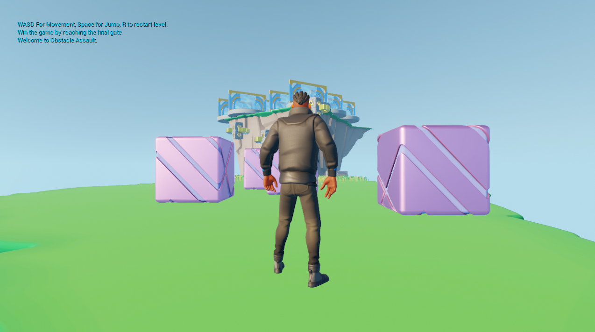
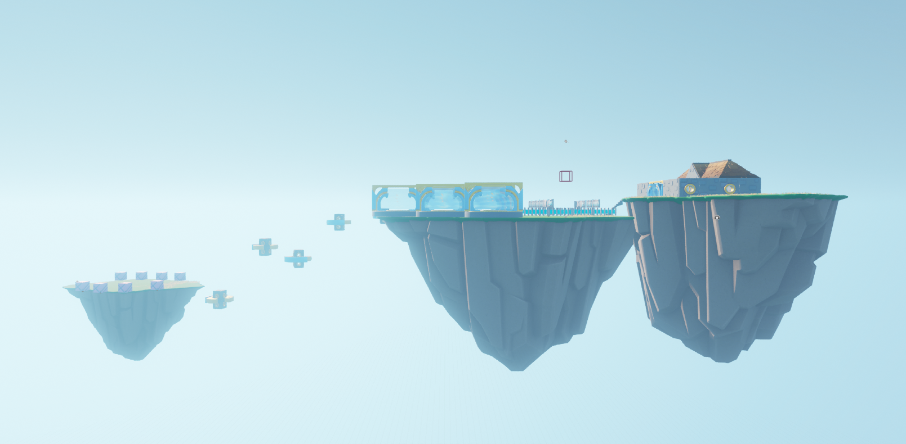
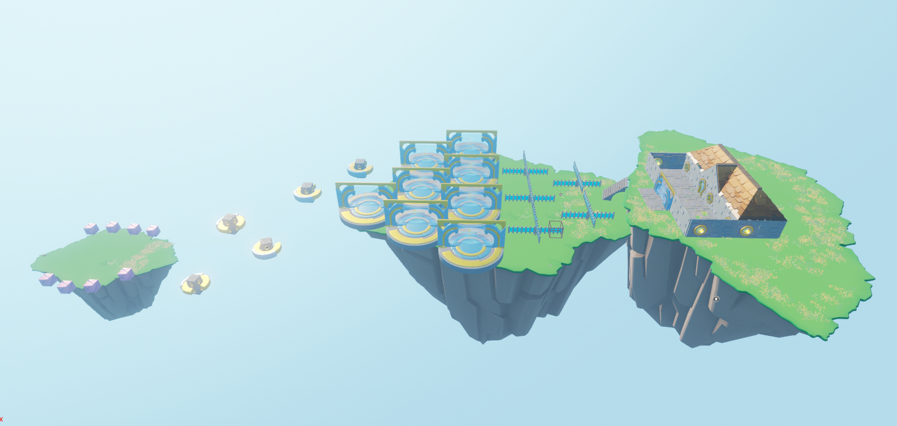

# Game Development with Unreal Engine 5

## Warehouse Wreckage
- Using Blueprint Programming.
- Objective: Wreck the Warehouse by shooting cannon ball.
- Control: WASD to move around, Space to Shoot, R to Reload, Q to reset the level.

## Obstacle Assault
- Using Blueprint Programming and C++.
- Objective: Walk through the obstacle course to win the game.
- Control: WASD to move around, Space to Jump, R to Reload level.
- Screenshots:

## Crypt Raider

## Toon Tank

## Simple Shooter

* All projects were built under guidance of GameDev.tv team [https://www.gamedev.tv/](https://www.gamedev.tv/)
